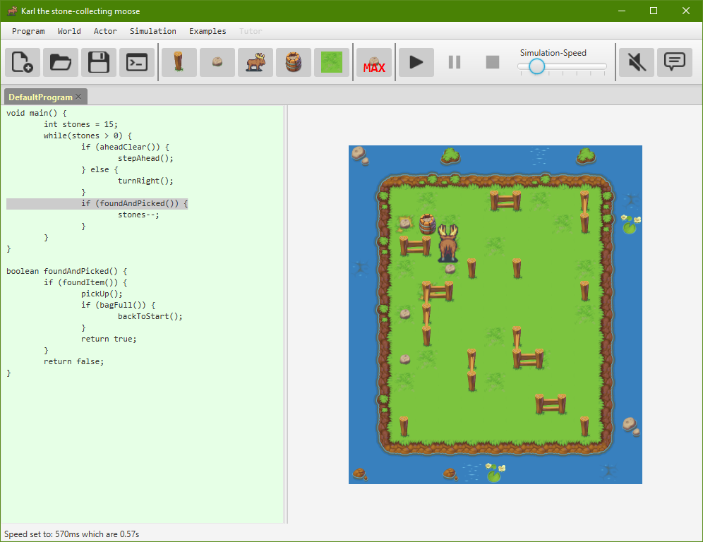

## Background ##

This is a homage to the "Java Hamster" (https://www.java-hamster-modell.de/).
It was written 10/2018 to 01/2019 as part of the exam within a university internship (https://uol.de/medieninformatik/lehrveranstaltungen/java-praktikum) which was also lead by the author/creator of the "Java Hamster".

## Start requirements ##

You need to download and add following dependencies/libraries/jars: 
* JavaFX with SWT-Interoperability: like v17 from https://gluonhq.com/products/javafx/
* Apache DB Derby: like v10.15 from https://db.apache.org/derby/derby_downloads.html

Then use/run the Launcher class/file.

## Historical notes ##

### implemented features which were not asked for (not sorted) ###
- [Tabs] every program/world has its on tab
- [Dragging any object] Not only the actor and start can be moved by dragging, also dragging any other object like fences copies them (override previous if necessary)
- [Background Music] loop of four tracks, loop shuffled on every application start
- [Colored Editor] background color for editor based on programs state (dirty = red / saved = blue / compiled = green)
- [Reset/Random World] resetting a world will remove all objects except actor and start / randomize world (size and objects)
- [Tutor: Request load by choice] When a tutor wants to load a students request he can select one of the available, if there is more than one
- [Tutor/Student: Answer/Request cancel] makes both cancelable, but student cannot cancel request if tutor is working on it
- [Zoom] Ctrl + mouse wheel on world panel
- [Graphics: dynamic fences] placing a fence near another connects them
- [Graphics: island] instead of fences and after that nothing, the "playfield" is surrounded by water, which makes an island
- [Graphics: variations of tiles] some graphics have variations which gets defined on world creation

### Reset exmaples ###
In order to remove all examples you may delete the folder miniworldDB in the application folder when not running it.

### Using this application in a tutor/student environment ###
A specific property file will be created in the user-home directory under directory .miniworld, if not already present.
This property file defines the connection details for java RMI and in which role the application should start.
It has to be changed according to your environment per machine.
This file gets loaded once on start.
For testing purposes you may start the app, edit property file and start a second instance.
Window title is changing based on which role you have.

### known errors ###
- canvas get broken when there are too many actions in rapid succession

### open todos ###
Search the code for the keyword TODO
They mark features or refactorings i would like to do

### incomplete exercises ###
exercise sheet 2 - exercise 4 - build a console interface to test the world and actor functions (inner model)
    --> due to work and implementation of extra features i could not spend time to post-implement this
exercise sheet 9 - exercise 19 - load world xml by SAX / DOM / StAXCursor / StAXIterator
    --> used java.beans.XMLDecoder instead / see ActionWorldController#onWorldLoad

